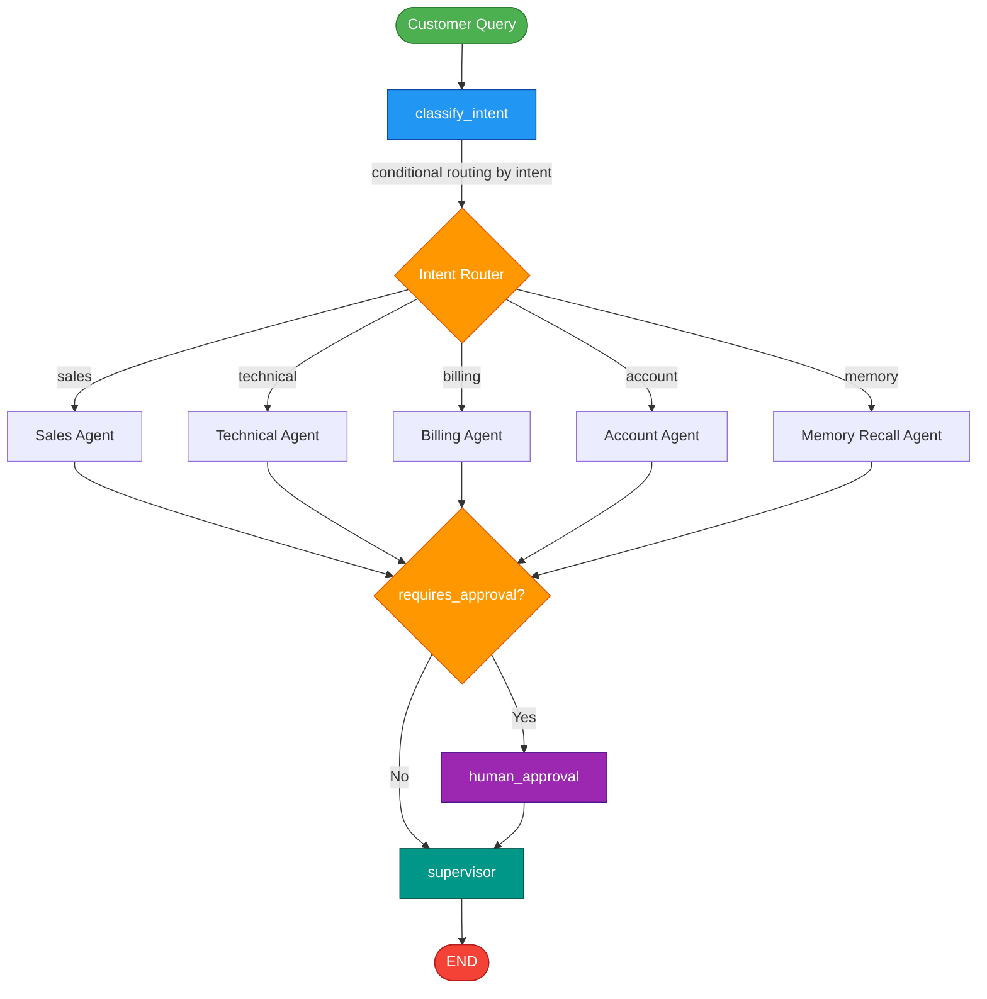
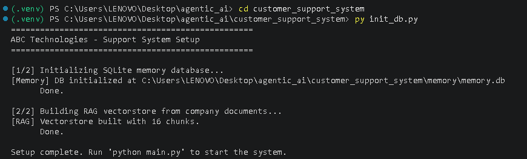
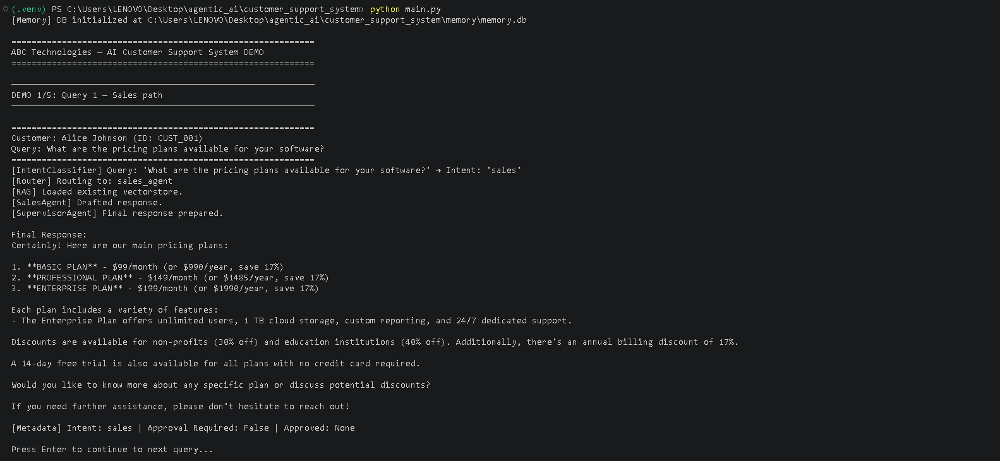
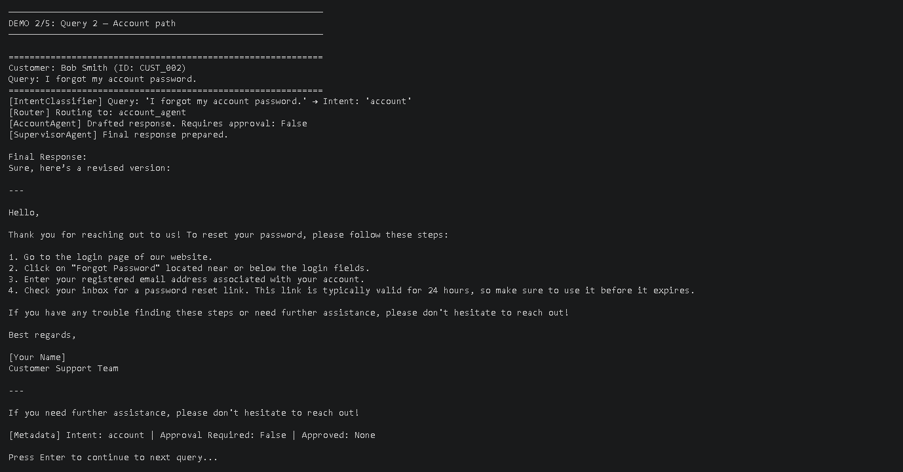
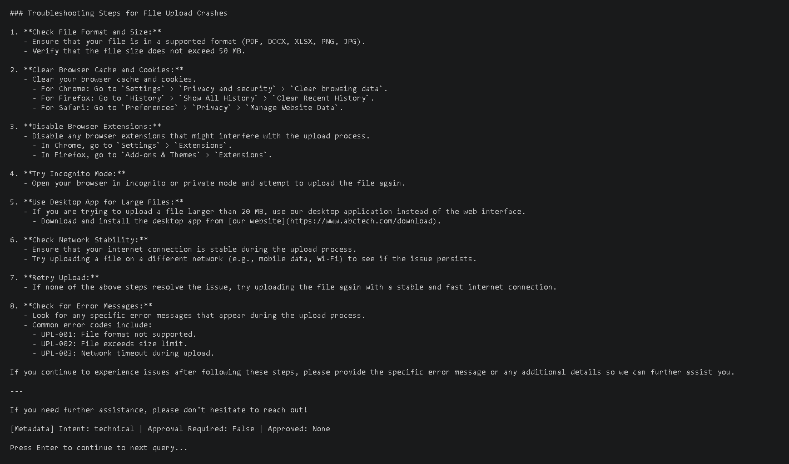
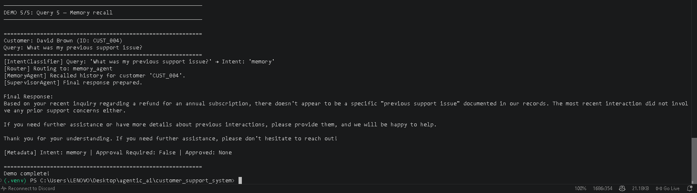

# ABC Technologies — AI-Powered Customer Support Automation System

Built with **LangGraph**, **LangChain**, **Ollama (llama3.2:3b)**, **ChromaDB (RAG)**, and **SQLite (Memory Storage)**.

---

## 📁 Project Structure

```
customer_support_system/
├── main.py                  # Entry point (demo + interactive)
├── graph.py                 # LangGraph workflow (Tasks 1, 4)
├── state.py                 # State structure (Task 2)
├── init_db.py               # One-time setup: DB + vectorstore
├── schema.sql               # SQLite schema for submission
├── requirements.txt
├── .env.example
├── agents/
│   ├── intent_classifier.py # Task 3 — Intent classification
│   ├── support_agents.py    # Task 5 — 4 specialized agents + memory agent
│   ├── human_approval.py    # Task 8 — Human-in-the-loop
│   └── supervisor_agent.py  # Task 9 — Supervisor review
├── rag/
│   └── rag_pipeline.py      # Task 6 — RAG with ChromaDB
├── memory/
│   └── sqlite_memory.py     # Task 7 — SQLite conversation memory
├── docs/
│   ├── company_policy.txt
│   ├── pricing_guide.txt
│   ├── technical_manual.txt
│   └── faq.txt
└── screenshots/             # Demo output screenshots
```

---

## ⚙️ Setup Instructions

### 1️⃣ Install Dependencies

```bash
pip install -r requirements.txt
```

This installs LangGraph, LangChain, Ollama integration, ChromaDB, and required text splitters.

---

### 2️⃣ Start Ollama & Download Models

Start the Ollama server:

```bash
ollama serve
```

In a new terminal, pull required models:

```bash
ollama pull llama3.2:3b
ollama pull nomic-embed-text
```

(Optional) Configure environment:

```bash
cp .env.example .env
```

---

### 3️⃣ Initialize Database & Build Vector Store

```bash
python init_db.py
```

This will:
- Create `memory.db` (SQLite conversation memory)
- Create `chroma_db/` (vector embeddings for RAG)

---

## ▶️ Run the System

### ✅ Demo Mode (5 Predefined Queries)

```bash
python main.py --demo
```

### ✅ Interactive Mode

```bash
python main.py --interactive
```

---

## 🧠 LangGraph Workflow



---

## 🧪 Demo Queries & Routing

| # | Customer Query | Routed To |
|---|----------------|-----------|
| 1 | Pricing plans? | Sales Agent |
| 2 | Forgot password | Account Agent |
| 3 | App crashes on file upload | Technical Support Agent |
| 4 | Need a refund for annual subscription | Billing → Human Approval |
| 5 | What was my previous issue? | Memory Recall Agent |

---

## 📸 Screenshots
### 🔹 Query 1 — Initializing DB


### 🔹 Query 1 — Sales Inquiry (Pricing Plans)


### 🔹 Query 2 — Account Management (Forgot Password)


### 🔹 Query 3 — Technical Support (App Crash)



### 🔹 Query 4 — Billing with Human Approval (Refund Request)
**Step 1 — Agent Response & Approval Trigger**

**Step 2 — Final response**


### 🔹 Query 5 — Memory Recall (Previous Issue Lookup)


---

## 🚀 Key Features

✅ **Intent Classification**  
Ollama (`llama3.2:3b`) classifies queries into:
- Sales  
- Technical Support  
- Billing  
- Account Management  
- Memory Recall  

✅ **Retrieval-Augmented Generation (RAG)**  
ChromaDB retrieves relevant chunks from:
- Company Policy  
- Pricing Guide  
- Technical Manual  
- FAQ  

✅ **Persistent SQLite Memory**  
Stores complete conversation history per customer.

✅ **Human-in-the-Loop Approval**  
CLI-based approval required for:
- Refunds  
- Subscription cancellations  
- Account closures  
- Compensation requests  

✅ **Supervisor Agent**  
Final review layer that validates, refines, and ensures response quality before delivery.

---

## 📌 Summary

This system demonstrates a **multi-agent AI customer support architecture** using LangGraph with:
- Conditional routing  
- RAG-powered knowledge retrieval  
- Persistent memory  
- Human approval gates  
- Supervisory oversight  

Designed for modularity, scalability, and production-style orchestration.